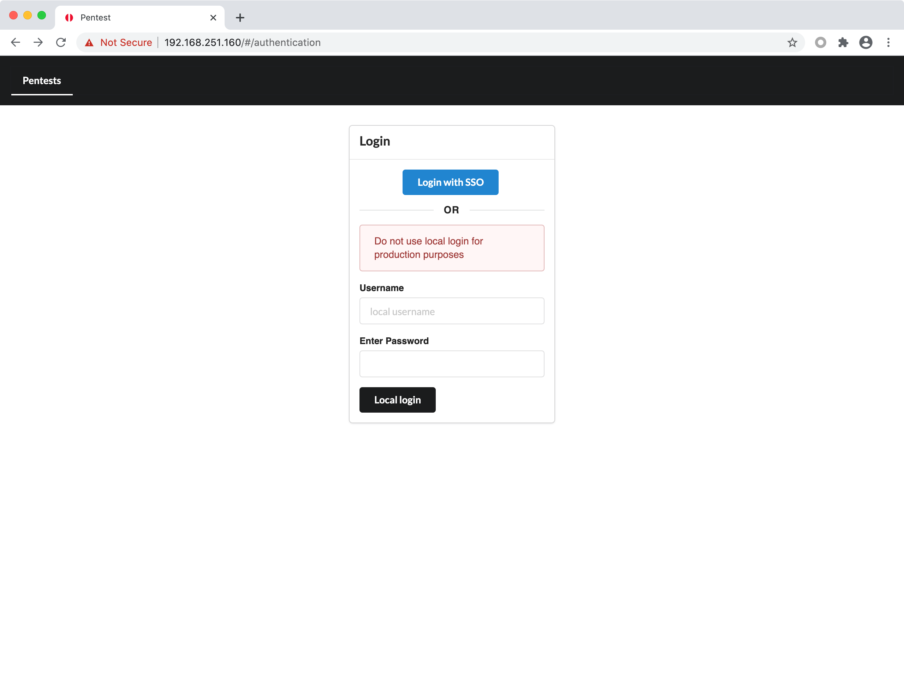
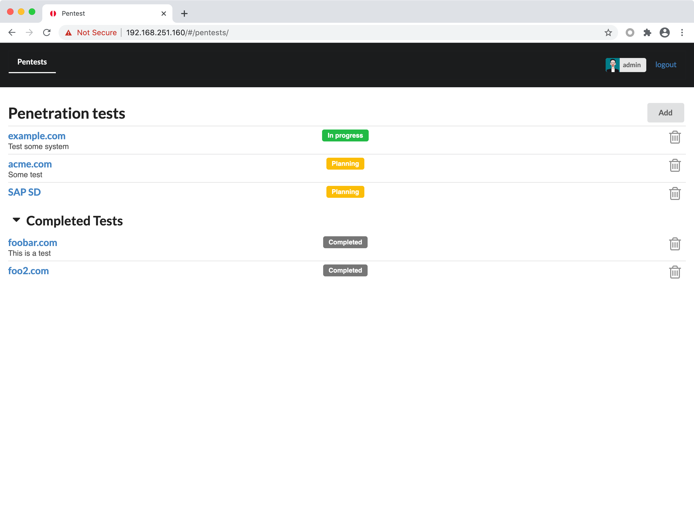
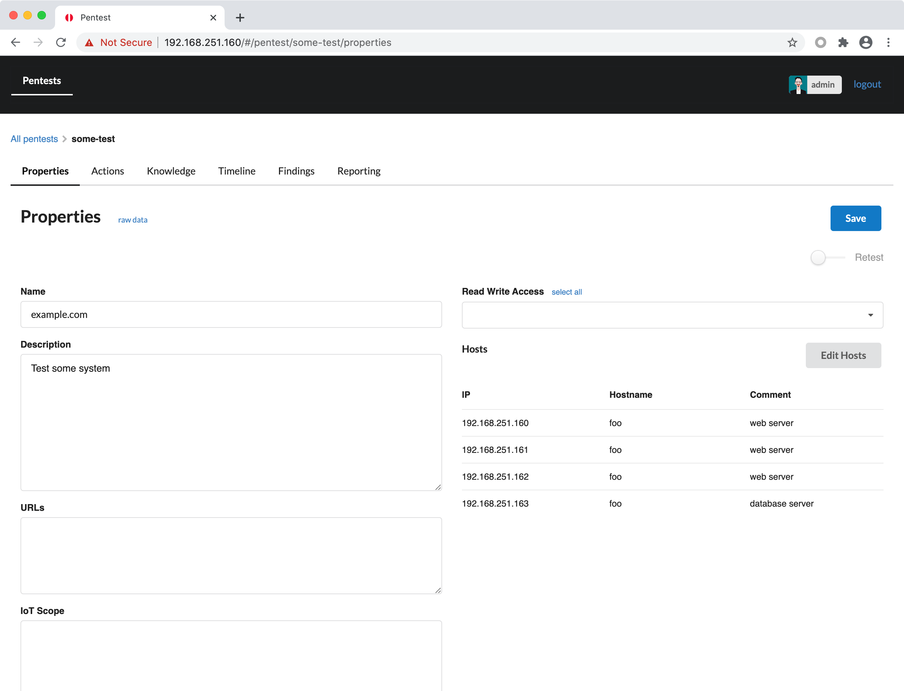
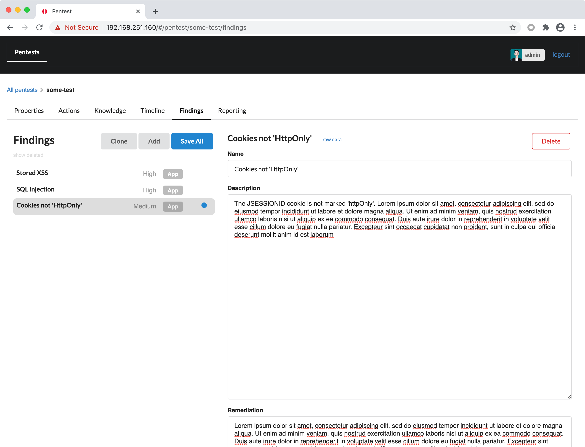
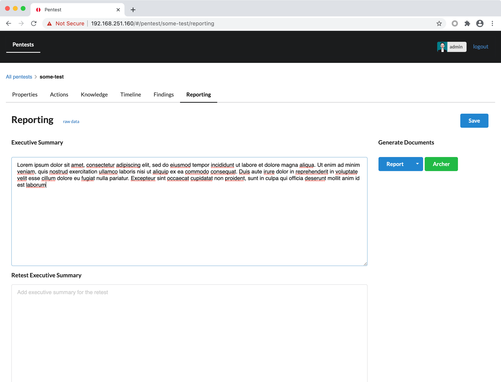

A **penetration test reporting tool** with automation of initial scans. Allows pentest teams to track a list of engagements, define scope, and automate repetitive scanning activities (nmap, dirb, showmount, screenshots of all web services with EyeWitness, nikto). The reporting module allows to describe findings, classify severity and attach screenshots. Reports can be exported to a `.doc` format using a fully customizable template. An experimental *knowledge* module allows to automate some repetitive lateral movements with known SSH credentials. 

See the [movie here](docs/pentest-movie.mp4).

        |  
:-------------------------:|:-------------------------:
 Login with SAML           | List of pentests
   |  
 Customizable properties of a pentest   | Initial scans automated
  |  
 Documenting findings of a test | Report generation with export to .docx 

Internally, the tool spins up 3 docker containers, one for the web server + SPA client (NodeJS, React), one for the actions module (nmap, EyeWitness, etc) and one for the database (MongoDB). 

## Installation

You need a `docker` service running on the host.

Then, pull the repository and run: 

```
cd ./docker
./init.sh    # do it only once
```

If everything goes well (unlikely), visit `https://127.0.0.1/` (accept certificate issue), and login with user `admin` and the random password displayed by the initialization script.

All configuration is in the `./config/default.json`. A random password for the `admin` user is generated upon installation. The clear text password shown after the installation can also be found at the end of `./config/default.json`. Local passwords are intended for demonstration purposes only - *configure SAML for production use.*

### Installation troubleshooting

In internal deployments, installation may fail due to proxy requirements / internal DNS settings. Try `export http_proxy=...` and `export https_proxy=...` if docker containers fail to build - those environment variables propagate to docker containers as they build. 
 
## Post-installation steps

The system is usable with random credentials of the  `admin` user (see above) after the instalation. You will often want to do these steps to tune the tool to your needs. **NOTE**: After any configuration change, run `rebuild.sh` from the `/docker` folder.  

* Configure SAML. Point your SAML IDP to use `https://<yourserver>/login/callback` as a callback and configure the login URL in the `default.json` file (`.PentestServer.saml.samlStrategy`). Put the PEM, Base64-encoded certificate contents (without haders/footers/newlines) in the `cert` attribute. Define the attribute name from the SAML token that describes the username (`uniqueUserIdAttributeName`). Disable login with locally configured users (set `.PentestServer.localUsers.enabled` to `false` in `default.json`). 
* Without SAML you might create users in the configuration file directly same as the `admin` user is created (`.PentestServer.localUsers`), but their passwords are stored clear text there. It's intended for demo/development only. 
* Configure authorizations. Define who is authorized to use the system by editing `.PentestServer.permissions`. There are 3 permission types: `read_write_all` (admins), `read_write_only_assigned` (access only tests explicitly assigned to the user), `read_write_between_dates` (access all tests within a date range). See examples in the config file.
* If per-pentest permissions are used (`read_write_only_assigned` above), define a UI-level picklist with usernames that can be assigned to a pentest. Populate usernames that will be available in `.PentestClient.postAuthConfiguration.pentest.properties.accessPicklist`. (No automation here; just populate the users used in permissions above).
* Configure UI-level picklists. Most interesting attributes of a pentest record can be customized in the same `./config/default.json` file. E.g. a pentest record can be configured to have arbitrary attributes like the test requestor, data classification, components in scope, etc. The default configuration (`.PentestClient.postAuthConfiguration.pentest.properties.inputFields`) has a representative sample of possibilities (text fields, picklists, etc.). 
* Setup https. Swap the temporary self-signed certificate (generated on installation) to the proper certificate. Configure path to the certificate/key files in `.PentestServer.https.keyFile` and `.PentestServer.https.certFile`. 

Remember to run this after any configuration changes:
`cd ./docker`
`./rebuild.sh`

# Internals (if you want to change things)

## Client

This is a React static web application, managed by yarn. For development, enter the `./client` folder and run `yarn` (to install depndencies) and then `yarn start`. To generate a production build, run `yarn build`. The code will be generated in `client/build/` folder -- host that static content on your web server (required for deployments only; for development use `yarn start` only).

## Server

Server app is based on nodejs. It requires MongoDB setup independently. The server code wraps MongoDB into REST API and applies authentication and session management on top of it. SAML authentication is supported (configured with PingID). Hardcoded users are supported for development puroposes -- must not be used on production (e.g. passwords are stored clear text in the config file).

All server configuration is in the `server/config/default.json` file.

## Actions (Jobs)

Actions allow to run predefined scanning activities against the servers in scope. Different actions (e.g. nmap scan, EyeWitness screenshot capture) are configured and depend on each other (e.g EyeWitness runs only after nmap is done and detection of http ports is finished). The jobs engine utilizes the MongoDB `actions` collection. Jobs (actions) are triggered from the web UI. It results with creation of an action document with `is_trigger: true` attribute. Custom actions are run for each 'trigger' action in each pentest. The `Action` wrapper class takes care of finding trigger actions, running jobs against them and saving results back to the MongoDB.

Specific actions (e.g. port scanning job) inherit from `Actions` python class. Each Action specifies its name and a list of action names (`action.name`) that it depends on. E.g. an action can depend on `['full_scan_trigger', 'port_scan']`, meaning that it'll be ready to run only once there is a `full_scan_trigger` and `port_scan` action are already completed for this pentest (To be precise, the status of the trigger action is ignored as it never changes. Only non-trigger actions must be in `status: 'done'` to treat them as satisfying the dependencies).

Actions are implemented in Python and run in a separate Docker container. To create a custom action, inherit from the `Action` class, pass own name and the array of dependent action names (see above) in the constructor, and implement the `run` method. `run` will be given a dictionary on input, with each dependent action name as a key (and its result as a value). Additionally, the `_trigger` key contains the data from the root-level 'trigger action' (i.e. an action with `is_trigger: true`). This can be used to retrieve original parameters for the scan. In particular, an action could specify only `port_scan` action as dependency, and get the original `full_scan_trigger` action via `_trigger` value. The engine takes care of running individual actions only when their dependencies are met already.

To run an action/job use the command like below (until it's dockerized / scheduled):

`python3 ./portScanAction.py `

Actions can generate files on output. Call `getOutputPath` to obtain a local path to a folder when action files can be stored. Those files will later be accessible under `https:/.../actionfiles/<ActionId>/` URL. For each file that the end user may want to see, register it by calling `reportOutputFile(relative_path)`. Links to those files will be shown in the web UI. E.g. if an action generates HTML with many files (e.g. images referenced form the index.html), `reportOutputFile('report.html')` should be called - the dependent resources will be exposed too. Use of `reportOutputFile` is optional - files will be saved regardless of that.  

## Knowledge (experimental)

This experimental module was used for mass SSH burte force attacks using a narrow set of stolen credentials. The use case was to start with a set of credentials, check them against other servers, try to grab /etc/shadow, feed it into a password cracker, add new credentials to the dictionary, and start the cycle. All of it done statefully, to never test the same server/user/password twice. 

While Actions module uses tree-like dependencies model, good for initial discovery, the Knowledge module keeps state of all that is known about the hosts. Knowledge's `StateAction` class takes care of running tasks only once (e.g. no retry of the same password), only when needed (e.g. no trial of another password if some yet another password already worked; e.g. no command execution with every user if the command was already executed successfully by some user). 

Knowledge compoments include:
 - `actionsToKnowledge.py` - converts findings from Actions into the Knowledge. E.g. creates a separated document for every host/port combination, with all the data identified about it by various actions.
 - `uploadKnownPasswords.py filename.txt` - uploads a list of known username/password pairs. It's intended to upload relatively narrow set of passwords found elsewhere that should be tried.
 - `SSHScanner.py` - sample use of the `StateAction` framework. Checks if known passwords work against the SSH ports opened across the hosts in scope.
 - `SSHAll.py` - interactive, parallel SSH against all hosts/users known. Two modes: `-s` gives text-based shell results, `-x` opens a separate XTerm window for each host/user. The latter can be used to test interactive cases like `su`.
 - `SSHExec.py` - executes a list of ssh commands against hosts. Results are stored back to the Knowledge database. Different modes in place: `foreach_host` to look for one successful result for every host (e.g. `cat /etc/shadow`) or `foreach_userhost` to look for results for each user on each host (e.g. `id`).

### Prerequisites

Knowledge scripts are intended to be run locally (i.e. not on the server). Follow these steps to initialize:
 - Ensure Mongo is exposed and visible to the localhost.
 - Create your very own Mongo username. Use `/docker/create_mongouser.sh username` on the application server to get the script with credentials. Run that script on localhost in the `/knowledge/` folder. Mongo connection string will be stored in `mongo_password.txt`.
 - Specify the pentest you're working on by running `echo -n 'yourpentestid' > pentest_id.txt` in the `/knowledge/` folder. The scripts will restrict themselves to that pentest only.

In MongoDB, the `knowledge` collection is used to keep the state of past trials and their results. 

### Prerequisites

```
pip3 install python-nmap
pip3 install pymongo
```

Python 3 is needed.

## Docker

The application is expected to be run in a set of docker containers. The initialization scripts are in the `/docker` folder. `/docker/init.sh` script should be run exactly once upon applicaiton setup (from within the `/docker/` folder). For a complete and *DESTRUCTIVE* reinstall of the docker setup (all pentests data will be wiped) execute the below from the `/docker` folder:
`rm -f ./mongo_admin.password ;docker-compose down ;docker-compose rm -fv; docker ps ; ./init.sh`

The `/docker/init.sh` script picks random passwords and secrets (passwords of Mongo users: `admin`, `webapp`, `actions`; secret for the node session tokens), establishes Docker containers for MongoDB, Node and Actions, and creates Mongo users accordingly. All random passwords are stored in the `/docker/*.password` files (and also in the `/docker/node/config/credentials.json`).

The `/docker/rebuild.sh` script recreates containers upon the latest code and configuration in the repository.

MongoDB stores its data on the host, in the Docker's docker_mongodatavolume volume. Containers setup is managed by the `/docker/docker-compose.yml` file. The content of the node container needs to be copied to from the other folders first however (this is what `/docker/rebuild.sh` is for.)

All the application data is stored in the `pentest` database within MongoDB. Mongo is not expected to be exposed directly to the external world.

Files generated by actions are stored in the `actionfilesvolume` Docker volume. The volume is shared across the node and the actions docker containers. This is how files generated in the actions container can be later served to the end user via web browser.

## Actions development

To develop Actions from a remote computer follow these steps:
* On the application server, expose mongo to the external world with `PentestServer.docker.mongodb.exposeExternally: true` and  `PentestServer.docker.mongodb.externalPort: XXXXX`. Go to `/docker` and run `./rebuild.sh` to have changes applied.
* Copy `/config/credentials.json` file from the application server to your local computer's repo clone.
* Create the `/config/default.json` file (from the `default.json.example`), and change these attributes: `PentestServer.mongodb.host: "application.server.hostname.com"`, `PentestServer.mongodb.port: XXXXX`.
* Set `PentestServer.actions.sharedFolder: '/tmp'` in the `/config/credentials.json` -- this is to store actions file-based results on the localhost.
* Go to `/actions` and run `python3 yourActionFile.py`. This will run an action against the remote server and save the results there.

## Configuration (production / development)

All configuration is stored in the `/config` folder. The `/config/default.json` file stores majority of configuration. 

Internal passwords and secrets (MongoDB) are isolated to the `/config/credentials.json` file. That file is re-generated during docker initialization (random passwords created). The `/config/credentials.json` file is overwritten by the `/docker/init.sh` script. Don't change this file. 

The repository comes with a sample configuration file: `/config/default.json.example`. It is copied to `default.json` when running `init.sh`.

For production deployments it is recommended to use the following options:
* `PentestServer.saml.enabled: true` -- use SAML as the only source of the authentication
* `PentestServer.saml.authorizedUses: ['john', 'tom', ...]` -- list authorized usernames Here
* `PentestServer.docker.mongodb.exposeExternally: false` -- restrict MongoDB visibility to the internal Docker network. Do not expose it from the host server.
* `PentestServer.mongodb.localUsers.enabled: false` -- local users are only for development purposes for now.
* `PentestServer.mongodb.apiRequiresAuthentication: true` -- otherwise the REST API for Mongo will not require any authentication/cookie!
* `PentestServer.mongodb.cors.enabled: false`

For development purposes, the following options can be considered:
* `PentestServer.docker.mongodb.exposeExternally: true` -- to access Mongo from your own machine. Set `PentestServer.docker.mongodb.externalPort: XXXXX` to see MongoDB on the XXXXX port externaly.
* `PentestServer.localUsers.enabled: true`, add user credentials to `PentestServer.localUsers.users` and authorize local users by listing them in `PentestServer.authorizedUsers` list.
* `PentestServer.cors.enabled: true` -- to allow CORS connections from `localhost:3000` origin. This allows client development from localhost (with `yarn start`) and having the server-hosted API still accessible.
* `PentestServer.mongodb.apiRequiresAuthentication: false` -- this will make the `https://.../api/v1/` accessible without *ANY* authentication. **VERY INSECURE**
* `PentestServer.docker.node.enabled: false` -- to disable running node from within the docker container. This allows to run `node server.js` manually form the host (otherwise the docker node container blocks the port used in the configuration file).

For node development on the host server (without docker) use these (run MongoDB in docker, but node locally):
* `PentestServer.docker.mongodb.exposeExternally: true` -- to have MongoDB run in a container and have it accessible from the host machine.
* `PentestServer.docker.mongodb.externalPort: XXXXX` -- to have docker expose mongo on XXXXX port to the host (and the outside!).
* `PentestServer.mongodb.host: "localhost"` -- makes nodejs look for the mongodb on the localhost
* `PentestServer.mongodb.port: XXXXX` -- node will look for mongodb on that portable
* `PentestServer.docker.node.enabled: false` -- this will prevent docker from running node in a container, freeing up the `PentestServer.https.port` for the manual execution of `node server.js`.
* `PentestServer.actions.sharedFolder: '/tmp'` -- this is to store actions file-based results.

With such a configuration, go to `/docker`, run `./init.sh` (or `./rebuild.sh` if already initialized) to have the dockerized MongoDB running. Then go to the `/server/` folder and run `./local-client-rebuild.sh` whenever the client app changes. Then run `./node server.js` to start the node server manually.

## UI Development -- Getting started with local dev
To make client side changes, you will need to develop using your local computer, while the server with the APIs may be hosted remotely. To develop from your local machine:
* Clone the repo to your localhost
* Edit the second line in `client/src/utils.js` to `const urlPrefix = (window.location.hostname === 'localhost') ? "https://<remote server running the framework>:443" : "";`
* Run `npm install` to obtain the required packages if they aren't already installed
* SSH into the pentest server and migrate to `/var/www/pentest-localdev/server` -- Start the server using `sudo node server.js`
* Visit `https://<remote server running the framework>:443` and login using the local credentials to generate the neccessary cookies
* On your local machine, migrate to the client folder and run `yarn` then `yarn start` -- this starts your react-app. The app can be accessed on `localhost:3000`
* Login using the same local credentials provided earlier

## Plugins

Server-side API can be extended by dropping a `.js` file to the `server/plugins/` folder. See sample plugins for details. The plugins are loaded automatically on startup and get the required context on input (MongoDB, authentication). It is up to a plugin to define authentication / authorization needs. Sample use cases:

* `.doc` report extracts
* Extract statistics needed for reporting
* Expose scope of ongoing tests to the Blue Team.

# License

[MIT](LICENSE)
